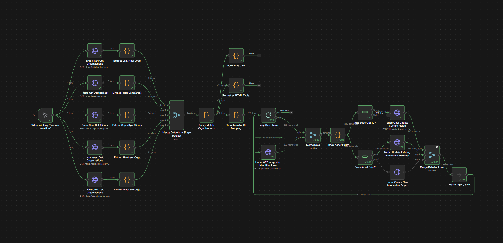

# Cross-Platform ID Sync

Automated bidirectional synchronization of organization IDs across MSP platforms.

## Workflow Architecture



## Overview

This workflow maintains cross-platform organization ID mappings by:
1. Querying 5 MSP platforms and fuzzy-matching organizations by name
2. Creating/updating Integration Identifier assets in Hudu (canonical source)
3. Writing platform IDs back to SuperOps custom fields

**Built from:** This workflow was originally based on the [Platform Comparison workflow](https://github.com/evenstar-ryan/n8n-workflows/tree/main/workflows/platform-comparison) and evolved to include bidirectional ID synchronization.

## Purpose

**Business Problem:** Organizations exist across multiple MSP platforms with inconsistent naming and no centralized ID mapping. This makes it impossible to:
- Route alerts/tickets to the correct client automatically
- Generate cross-platform reports
- Maintain data consistency across tools
- Onboard new clients efficiently

**Solution:** Automated fuzzy matching + bidirectional ID sync across all platforms.

## Platforms Integrated

1. **Hudu** (Documentation) - Canonical source of truth
2. **SuperOps** (PSA) - Receives all platform IDs via custom fields
3. **NinjaOne** (RMM)
4. **Huntress** (Security)
5. **DNS Filter** (Security)

## What It Does

### Phase 1: Platform Comparison & Fuzzy Matching
- Queries all 5 platforms for organization lists
- Normalizes names (lowercase, remove punctuation)
- Groups organizations using 85% Levenshtein distance similarity
- Identifies which orgs exist in which platforms

### Phase 2: ID Mapping & Sync
For each matched organization:
- **Hudu**: Creates/updates "Integration Identifiers" asset containing all platform IDs
- **SuperOps** (active clients only): Updates custom fields with platform IDs
  - `udf3text` = Hudu Company ID
  - `udf4text` = NinjaOne Org ID
  - `udf5text` = Huntress Org ID
  - `udf6text` = DNS Filter Org ID

## Output

- **285 organizations processed in under 3 minutes**
- **Hudu**: Integration Identifier assets for all companies
- **SuperOps**: Custom fields populated for active clients
- **Zero manual intervention required**

## Workflow Architecture
```
Manual Trigger
  ↓
[Query 5 platforms in parallel]
  ├→ SuperOps GraphQL
  ├→ Hudu REST API
  ├→ NinjaOne REST API
  ├→ Huntress REST API
  └→ DNS Filter REST API
  ↓
Fuzzy Match Organizations (Code node)
  ↓
Transform for ID Mapping (filter to Hudu companies)
  ↓
Loop Over Items (batch_size=1)
  ↓
  ├→ GET Integration Identifier Asset (Hudu)
  ↓
  IF Asset Exists?
    ├─ TRUE → UPDATE Asset
    └─ FALSE → CREATE Asset
  ↓
  IF Has SuperOps ID?
    └─ TRUE → UPDATE SuperOps Custom Fields
  ↓
Merge all branches → Loop back
```

## Key Design Decisions

1. **Hudu as canonical source**: All companies are in Hudu (past and present). SuperOps only contains active clients.

2. **Fuzzy matching threshold: 85%**: Balances false positives vs missed matches. Adjustable in "Fuzzy Match Organizations" Code node.

3. **Loop Over Items (not Split In Batches)**: Processes companies one at a time for better error handling and progress visibility.

4. **Merge pattern for data preservation**: HTTP Request nodes wipe out item data, so Merge nodes combine Loop data + API responses.

5. **Conditional SuperOps updates**: Only writes to SuperOps if `superops_id` exists (filters out former clients).

## Dependencies

### Required Credentials
- SuperOps MSP API (Multiple Headers Auth)
- Hudu API (Header Auth)
- NinjaOne API (OAuth2)
- Huntress API (Basic Auth)
- DNS Filter API (Header Auth)

See `credentials/README.md` for setup details.

### Hudu Configuration
- **Asset Layout:** Integration Identifiers (ID: 26)
- **Fields:**
  - SuperOps Client ID
  - NinjaOne Org ID
  - Huntress Org ID
  - DNS Filter Org ID
  - Avanan Org ID (reserved for future use)

### SuperOps Configuration
- **Custom Fields** (columnNames):
  - `udf3text` - Hudu Company ID
  - `udf4text` - NinjaOne Org ID
  - `udf5text` - Huntress Org ID
  - `udf6text` - DNS Filter Org ID

## Usage

### Running the Workflow

1. Open workflow in n8n
2. Click "Execute Workflow" on Manual Trigger
3. Wait ~2-3 minutes for completion
4. Verify results:
   - Check Hudu companies for Integration Identifier assets
   - Check SuperOps clients for populated custom fields

### When to Run

- **Weekly**: Catch new client onboarding
- **After platform changes**: If organizations are renamed/added/removed
- **Before QBR season**: Ensure all ID mappings are current

## Common Issues

**Issue:** Organization appears as separate entries despite same name
**Cause:** Name variation exceeds 85% similarity threshold
**Fix:** Manually standardize names in source platforms, or adjust threshold in "Fuzzy Match Organizations" Code node

**Issue:** SuperOps custom fields not updating
**Cause:** Company doesn't have `superops_id` (former client)
**Expected:** This is intentional - only active clients get SuperOps updates

**Issue:** Workflow times out
**Cause:** Too many organizations (>500 total)
**Fix:** Add pagination handling or run during off-hours

## Maintenance

### Adjusting Fuzzy Match Threshold

Edit "Fuzzy Match Organizations" Code node:
```javascript
const threshold = 0.85; // Increase for stricter matching, decrease for looser
```

### Adding New Platforms

1. Add HTTP Request node to query new platform
2. Add extraction Code node to normalize data
3. Update Merge node to include new platform
4. Add field to Hudu Integration Identifiers asset layout
5. Add field to SuperOps custom fields (if applicable)
6. Update "Check Asset Exists" Code node to preserve new field
7. Update CREATE/UPDATE nodes with new field

## Version History

See `CHANGELOG.md` in this directory.

## Related Workflows

- **Platform Comparison** (original): Generates comparison reports only, no ID sync
- **Ticket Routing** (planned): Will use these ID mappings to route alerts

## Performance

- **Execution time**: ~2-3 minutes for 285 organizations
- **Throughput**: ~3 updates/second across 2 platforms
- **API calls**: ~570 total (285 Hudu + 285 SuperOps for active clients)
- **Rate limiting**: Well within limits (Hudu: 300 req/min)

## Notes

- Workflow uses **Hudu company IDs** from fuzzy matching, not company names (more reliable)
- **Data preservation pattern**: Multiple Merge nodes ensure platform IDs survive through HTTP requests
- **Error handling**: Continue on fail enabled for GET operations (asset might not exist)
- **Loop-back pattern**: All branches (CREATE, UPDATE, SuperOps) merge before looping back to prevent race conditions

## Troubleshooting

**No Hudu asset created:**
1. Check Hudu API credentials
2. Verify Integration Identifiers asset layout exists (ID: 26)
3. Check "Check Asset Exists" Code node output for errors

**SuperOps custom fields empty:**
1. Verify company has `superops_id` (check "Has SuperOps ID?" IF node)
2. Check SuperOps API credentials
3. Verify custom field columnNames match: udf3text, udf4text, udf5text, udf6text

**Loop not advancing:**
1. Verify Merge node has Mode: Append, Always Output Data: true
2. Check all branches (CREATE, UPDATE, SuperOps) connect to Merge
3. Verify single loop-back from Replace Me to Loop Over Items input

## Support

Contact: Ryan McKee (ryan@evenstarmsp.com)
